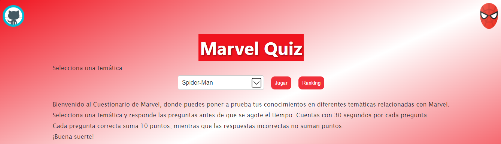
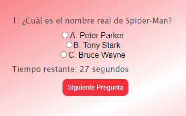

# Cuestionario Contrareloj

Una aplicación web simple de preguntas y respuestas sobre temáticas específicas.

## Descripción

La aplicación permite a los usuarios seleccionar una temática (por ejemplo, Spider-Man, Civil War, Avengers) y responder una serie de preguntas relacionadas con esa temática. Cada pregunta tiene opciones de respuesta y un temporizador. Después de responder, se proporciona un feedback y se muestra la puntuación final.

## Evidencia (Capturas de Pantalla)

## Características

- Selección de temática
- Preguntas con temporizador
- Feedback después de cada pregunta
- Puntuación final y posibilidad de volver a jugar

## Capturas de Pantalla

(Inserta capturas de pantalla aquí si las tienes)

## Instalación

1. Clona el repositorio: `git clone https://github.com/tuusuario/quiz-app.git`
2. Abre el archivo `index.html` en tu navegador.

## Uso

1. Selecciona una temática.
2. Responde las preguntas antes de que se agote el tiempo.
3. Recibe feedback y ve tu puntuación final.

## Tecnologías Utilizadas

- HTML5
- CSS3
- JavaScript

## Contribuir

Si quieres contribuir a este proyecto, por favor, sigue estas pautas...

## Licencia

Este proyecto está bajo la Licencia MIT - consulta el archivo [LICENSE](LICENSE) para más detalles.
